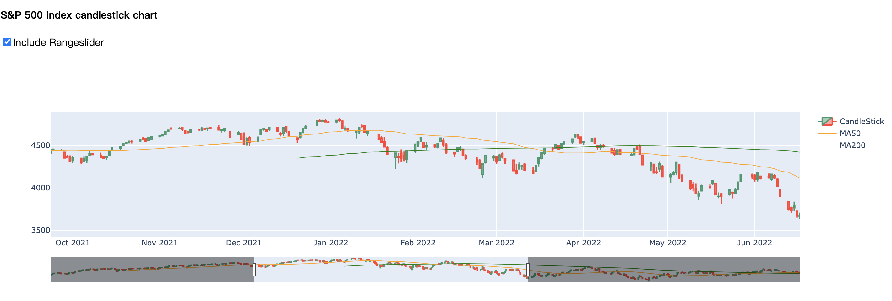
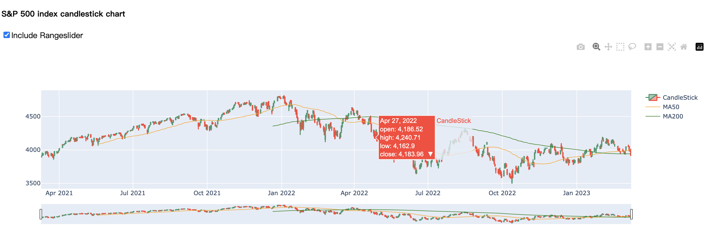
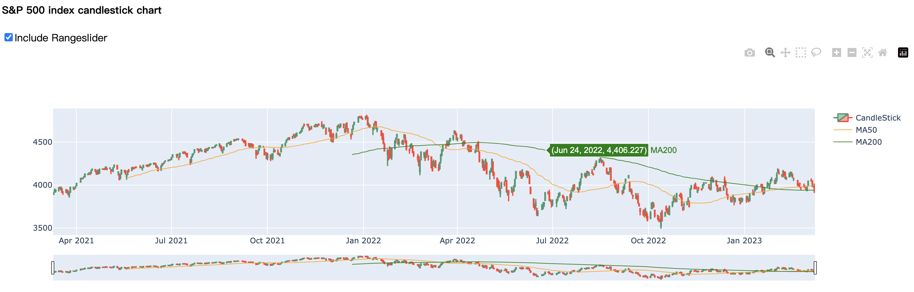

# S-P500Index

you can interact with the figure.

demo link: https://dashapp-btzsxgtkzq-ue.a.run.app/







## Environment

**IDE: ** Pycharm

**Language**: Python

## How to run

`yfinance`: yahoo finance package ([ref](https://github.com/ranaroussi/yfinance))

```python
pip install yfinance
```

`plotly`: plotting candle stick ([ref](https://plotly.com/graphing-libraries/))

```python
pip install plotly==5.13.1
```

`dash`: plot graph to web ([ref](https://plotly.com/dash/))

```
pip install dash
```


There are two files in this project

S&P 500 Index Plot.ipynb: how to plot using python

Candlestick : plot the figure on the web

